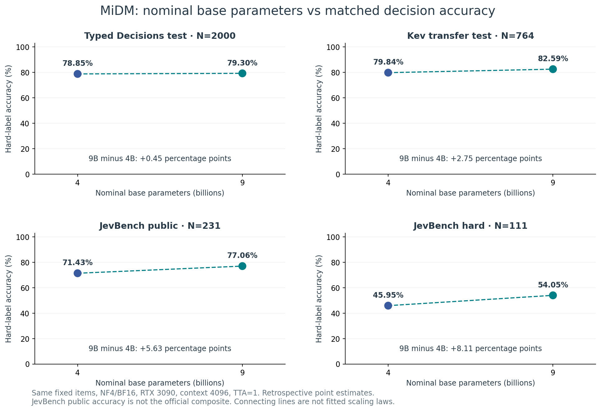
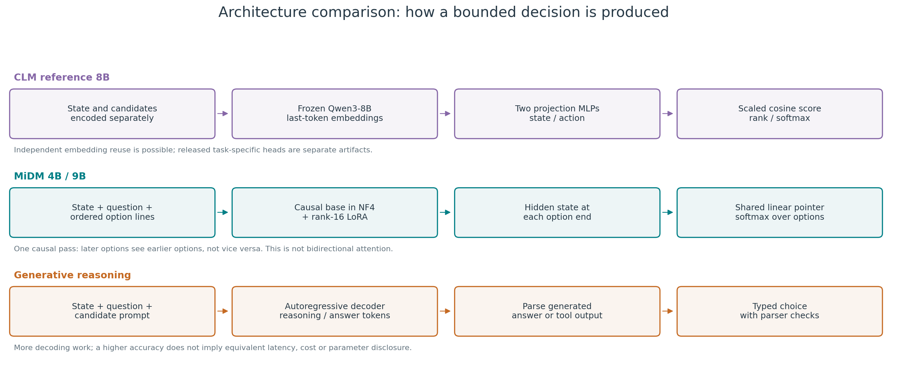
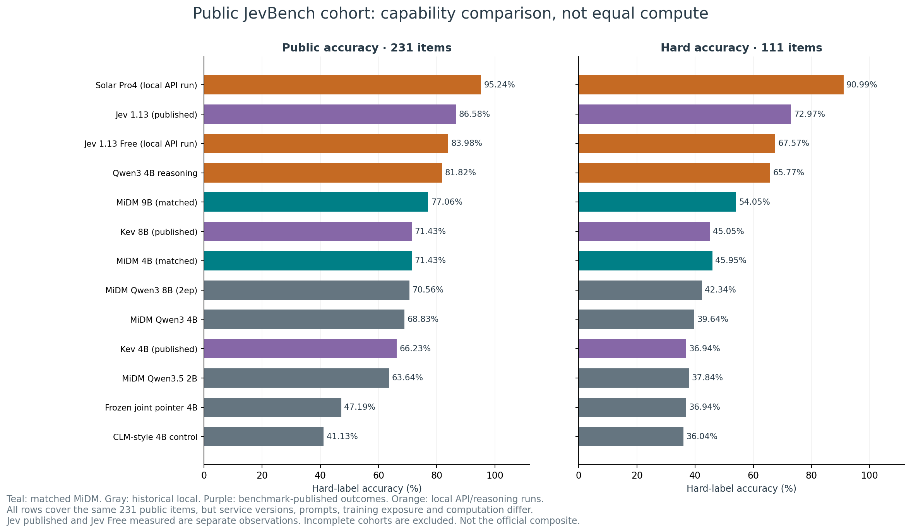

# MiDM: Minimal Decision Models, and an audit of CLM-8B

[](https://doi.org/10.5281/zenodo.23164651)

Code, results and write-up for a controlled study of small (up to 9B) typed-decision models on two consumer GPUs
(RTX 3090 + RTX 2080 Ti, Windows, no vLLM).

- **MiDM (Minimal Decision Model).** A causal LM reads the state, the question and every option line in one
  pass. A linear **pointer head** on the final hidden state at the end of each option line scores that
  option, and a softmax over options gives the answer. The base model is frozen in 4-bit NF4 and trained
  with LoRA r16 on every projection. Answers use the typed-decision ("System One") wire format:
  `choice`, yes/no `noul`, and `score`.
- **Audit of CLM-8B**, the Stanford/NVIDIA contrastive decision model (github.com/Contrastive-LM/CLM). We
  reproduce its DeepSWE best-of-4 verifier result exactly: 31/38 = 81.6%. Only 13 of the 38 tasks can be
  changed by the selector. On those tasks the result is 10/13 against a random expectation of 7.0, which
  gives an exact one-sided **p = 0.062**. The base head before task fine-tuning is below random.

## v0.2.1: benchmark coverage, architectures and parameter-performance figures

**Documentation/analysis update; model weights are unchanged.** [Full benchmark atlas](docs/evaluations/20261005/atlas/README.md) contains 13 model/settings rows, exact adapter/head parameter counts, provenance and reproducible PNG/SVG figures.





The atlas fills missing analysis and distinguishes measured, published and unavailable results. MiDM DeepSWE and local Terminal-Bench remain **unmeasured**: a recheck did not find the matching raw verifier candidate pools. No score is fabricated or copied from CLM. JevBench public accuracy is not its official sealed composite. Unknown proprietary parameter counts are not guessed.

## v0.2.0: MiDM 9B and completed evaluations

[9B model](https://huggingface.co/yunicro/MiDM-9B-q35-e1-bx) · [Release notes](docs/releases/v0.2.0/README.md) · [Full evaluation report](docs/evaluations/20261005/README.md).

Matched NF4/BF16 4B → 9B: Typed Decisions test **78.85% → 79.30%**, Kev transfer test **79.84% → 82.59%**, public JevBench hard **45.95% → 54.05%**. These are retrospective argmax accuracies, not official JevBench composite scores. SQL/Python selection does not improve consistently; the learned router remains below reasoning alone. Long-input two-process serving was slower despite fitting in VRAM.

[Same-date report integration audit](docs/evaluations/20261005/REPORT_INTEGRATION.md) provides aggregate operational checks only, with no private inputs, generated prose or investment-performance claim. The existing 4B model and historical results below remain available.

## Historical v0.1.0 headline results (each evaluation suite read once; `113_clm_reproduction_20260928/results/`)

| model | typed-decisions test | Kev transfer-v4 test | Kev transfer-v4 dev | JevBench public |
|---|---|---|---|---|
| CLM-style frozen Qwen3-4B + heads | 0.759 | 0.411 | 0.366 | 0.411 |
| MiDM-4B-q3-e1 (Qwen3-4B) | 0.789 | 0.716 | 0.700 | 0.688 |
| MiDM-8B-q3-e2 (Qwen3-8B) | **0.805** | 0.772 | 0.729 | 0.706 |
| MiDM-4B-q35-e1 (Qwen3.5-4B-Base) | **0.805** | 0.764 | 0.755 | 0.710 |
| **MiDM-4B-q35-e1-bx** (broadened data) | 0.788 | **0.798** | **0.791** | 0.710 |

Findings, with paired row-clustered bootstrap results in `results/stats/stats.md`:
- **Reading the options jointly is what transfers.** Ablation on Qwen3-4B with the same data:
  - a frozen bi-encoder head scores 0.411 on Kev transfer test;
  - joint options with a frozen base and only the pointer head trained scores 0.630;
  - adding LoRA scores 0.715.
  About 70% of the transfer gain comes from joint reading. LoRA adds most of the in-domain gain.
- **Data mix (`-bx`): +3.3 pp on Kev transfer test over 3 seeds** (0.763 ± 0.005 → 0.796 ± 0.002; per seed +3.4 / +3.8 / +2.7).
  There is no in-domain cost (typed-decisions −0.5 pp, within noise). The effect holds at 2B (+5.8 pp) and is gone at 0.8B.
- **Base generation and size.** These figures are precision-matched (bf16 vs bf16; fp16 vs bf16 alone was not significant).
  - Qwen3 → Qwen3.5 at 4B gives +3.4 to +5.9 pp on transfer suites.
  - Qwen3.5 2B → 4B gives +10.2 pp.
  - Effects depend on the suite and data mix; the historical 2B breadth gain above should not be read as a universal lower-size failure. See the current atlas for configuration-specific results.
  - Qwen3.5-4B equals Qwen3-8B (p = 0.69).
- **No gain from:** DoRA, rsLoRA, rank 64, attention-only LoRA, per-domain adapters (routed or merged), TTA over
  option orders, temperature scaling, and ensembles. A second epoch hurts transfer (−2 to −3 pp).
- **In-distribution dev does not select for transfer.** This held for epochs, data mix and cascade thresholds.
- **Gap to Jev, per item on the 231 public JevBench items.**
  - The gap is almost entirely the hard tier: 0.450 vs 0.730. Jev alone is right on 32 items, MiDM alone on 1.
  - Longer inputs (+0.9 pp) and long-document training (`-bxL`) did not close it. Single-pass option scoring is
    weak at multi-step reasoning.
- **Cascade cost.** Measured batch-1 latency on an RTX 3090 (bf16):

  | tier | latency |
  |---|---|
  | 0.6B | 151 ms |
  | 4B-q35 | 309 ms |
  | 8B | 196 ms |

  In this stack a cascade is not faster than the 8B alone. `results/speed/` has the details.
- **As a best-of-N selector for SQL and code (zero-shot, offline; `115_midm_selector_sql_code_20261001/`):**
  - code (LiveCodeBench hard, 80 problems): +10 pp over majority vote (p = 0.004);
  - SQL with retrieved examples: +1.1 pp on Spider test and +1.7 pp on a private holdout over majority vote.
  It does not beat the Solar Pro4 direct baseline significantly.

## Current comparison and benchmark coverage

| System / evidence | Typed Decisions test | Kev transfer test | JevBench public accuracy | DeepSWE held-out 38 |
|---|---:|---:|---:|---|
| Local CLM-style Qwen3-4B control (historical) | 75.90% | 41.10% | 41.13% | Not measured |
| MiDM Qwen3.5 4B (matched) | 78.85% | 79.84% | 71.43% | Raw candidate text unavailable |
| MiDM Qwen3.5 9B (matched) | 79.30% | 82.59% | 77.06% | Raw candidate text unavailable |
| Qwen3 4B reasoning (local) | Not measured in this matched run | Not measured in this matched run | 81.82% | Not measured |
| Jev 1.13 Free (local API run) | Not measured in this matched run | Not measured in this matched run | 83.98% | Not measured |
| Solar Pro4 (local API run) | Different dev subset; not a test score | Different dev subset; not a test score | 95.24% | Not measured |
| Released CLM 8B task-specific head (local replay) | Not evaluated here | Not evaluated here | Not evaluated here | 31/38 = 81.58% |

Only the MiDM 4B/9B primary rows are precision/protocol matched. Historical controls and API/reasoning rows differ in data, base, prompts and compute. All public JevBench rows above cover 231 items; public accuracy is not the official composite. The released CLM DeepSWE numerical result reproduces, but its mixed-task comparison with random has exact one-sided p=0.062.



See the [atlas](docs/evaluations/20261005/atlas/README.md) for published Jev/Kev outcomes, the hard tier, a parameter scatterplot, the historical architecture control, SQL/Python regressions, and the exact reasons each unavailable benchmark remains unmeasured. Model size, trainable adapter size, VRAM and latency are distinct quantities. The 9B model does not dominate reasoning models or improve all applications.

## Release
- Hugging Face: [yunicro/MiDM-4B-q35-e1-bx](https://huggingface.co/yunicro/MiDM-4B-q35-e1-bx) (public).
  It contains the LoRA adapter, pointer head, `midm.py` and the model card.

## Layout
- `113_clm_reproduction_20260928/`: CLM reproduction, frozen-head study and MiDM training/eval. See its `README.md`.
  - `pointer_lora.py`: MiDM train/eval (QLoRA, pointer head, `--tta`, `--save-probs`).
  - `decision_data.py`: all suites in one format (typed-decisions, Kev suites, JevBench, breadth sets).
  - `stats.py`, `build_ledger.py`: bootstrap tests and the test-read ledger (SHA-256 per result file).
  - `build_hf_package.py`, `hf_template/midm.py`, `verify_hf_package.py`: the Hugging Face release.
  - `gpuq.py`: a small Huey/SQLite GPU job queue (one worker per GPU, VRAM/utilisation start gate).
  - `data/breadth_v1/build_breadth_v1.py`: rebuilds the balanced-breadth set from public HF datasets.
- `114_local_model_router_20260928/`: local gateway (LiteLLM) plus a decision router (`MiDM-Auto` cascade),
  `MODELS.md` (catalogue), `DECISIONS.md` (every selection rule and its data).
- `docs/research/`: the report draft, the novelty and literature review, and references.

## Reproduce (outline)
1. Python 3.12. Install torch (CUDA) plus `transformers>=5.17 peft>=0.21 bitsandbytes>=0.50 pyarrow huggingface_hub`.
2. Clone the CLM repo at `bb42c6c5bf914fd449bed2f6ca65be80602cb1f7` into `113_clm_reproduction_20260928/repo/`.
   It is not vendored; the schema helpers are used under Apache-2.0.
3. Download the public data into `113_clm_reproduction_20260928/data/`: `LocalLLaMA/typed-decisions`,
   `jaredpalmer/kev-suites` and the JevBench public items. Then run `data/breadth_v1/build_breadth_v1.py`.
4. Train and evaluate, e.g.
   `PTR_BF16=1 python pointer_lora.py train --model Qwen/Qwen3.5-4B-Base --train td_train kev_train breadth_v1 pp6_new --epochs 1 --out runs/E/bx`,
   then `pointer_lora.py eval ... --save-probs`.

Datasets and model weights are not redistributed here. Datasets keep their own licences. The adapters are
released separately on Hugging Face: https://huggingface.co/yunicro/MiDM-4B-q35-e1-bx (Zenodo DOI 10.5281/zenodo.23164651)

## Citation (current documentation release)

For v0.2.1, use the version DOI and CITATION.cff below. Historical v0.1.0/v0.2.0 tags and DOIs remain available.
Authors: YeoHoon Yoon and Kyung-Sung Kim (Graduate School of AI, aSSIST University, Seoul, Republic of Korea).

```bibtex
@software{yoon_kim_2026_midm,
  author    = {Yoon, YeoHoon and Kim, Kyung-Sung},
  title     = {MiDM: Minimal Decision Models and an audit of CLM-8B},
  year      = {2026},
  version   = {0.2.1},
  publisher = {Zenodo},
  doi       = {10.5281/zenodo.23164651},
  url       = {https://github.com/YeoHoonYun/midm-decision-models}
}
```
See `CITATION.cff`. Archived on Zenodo: https://doi.org/10.5281/zenodo.23164651 (all versions: https://doi.org/10.5281/zenodo.23084583)
## License
Apache-2.0 (`LICENSE`); third-party notices are in `NOTICE`.

## Evaluation update — 2026-10-05

[Completed CLM/MiDM verification](docs/evaluations/20261005/README.md): matched primary BF16 and supplementary FP16 results, CLM DeepSWE replay, SQL/Python selection, routing and concurrency pilots. MiDM DeepSWE and local Terminal-Bench remain unmeasured because matching raw evaluation assets are unavailable.
