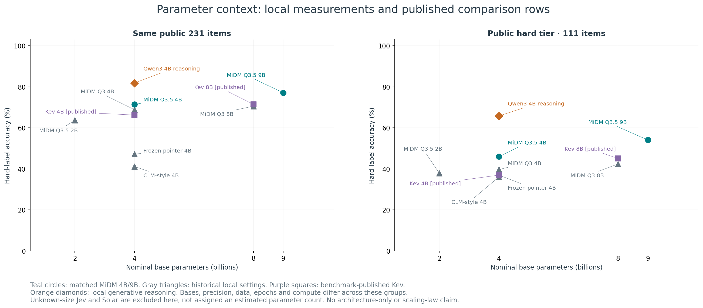
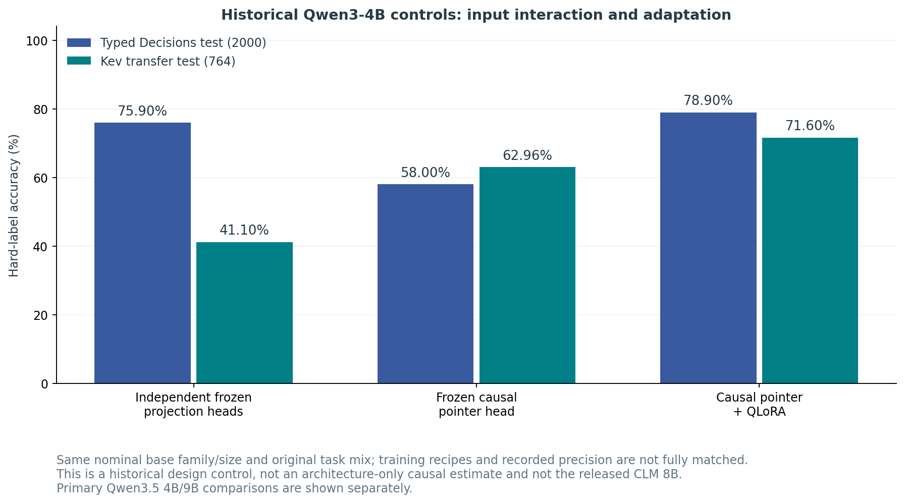

# Benchmark coverage, architecture and parameter-performance atlas

**v0.2.1 documentation and analysis update. Model weights are unchanged from v0.2.0.** All figures below are derived from completed runs or identified published outcomes. No new model inference, external paid model calls or financial results are implied.

## What fills the previous blanks

|Benchmark / metric|MiDM 4B|MiDM 9B|Comparison and status|
|---|---:|---:|---|
|Typed Decisions test (N=2000)|1577/2000 (78.85%)|1586/2000 (79.30%)|Matched local measurement|
|Kev transfer test (N=764)|610/764 (79.84%)|631/764 (82.59%)|Matched local measurement|
|JevBench public accuracy (N=231)|165/231 (71.43%)|178/231 (77.06%)|Matched local measurement|
|JevBench hard accuracy (N=111)|51/111 (45.95%)|60/111 (54.05%)|Matched local measurement|
|DeepSWE held-out 38, best-of-4|Not measured|Not measured|Released CLM head replay: **31/38 = 81.58%**. MiDM needs the same raw state/action texts; cached CLM embeddings cannot be used as MiDM inputs.|
|Terminal-Bench verifier, reported 30 tasks|Not measured|Not measured|CLM author reports 87.6%; matching candidate pool, head and full scoring protocol not found. Not a local result and not necessarily task-level integer accuracy.|
|Official JevBench composite|Not measured|Not measured|Public accuracy cannot replace sealed decisions, distribution calibration, controlled latency and cost axes.|

A blank score is not zero. Missing measurements remain explicit and are not plotted as zero or copied from another model. The [scoped upstream inventory](upstream_inventory.json) rechecks official GitHub and Hugging Face releases; it does not claim an exhaustive search of the internet. A fresh Terminal-Bench agent rollout would be a different experiment from the released best-of-N verifier comparison.

## Architecture: what is being compared

|System|Input interaction and output|Learned components|Parameter disclosure|
|---|---|---|---|
|Released CLM 8B|State and each candidate encoded independently; two projection MLPs; scaled cosine similarity|Frozen Qwen3-8B encoder plus learned state/action heads|Nominal 8B encoder; task-specific head differs from reference head|
|Local CLM-style 4B control|Independent encoded state/action features; projection heads|Local reimplementation, Qwen3-4B frozen|Nominal 4B; **not** released CLM 8B|
|MiDM 4B / 9B|State, question and option lines in one causal sequence; shared linear pointer at each option end; softmax over options|Frozen NF4 base + rank-16 LoRA + pointer|Nominal 4B / 9B base; exact adapter/head counts below|
|Qwen3 4B reasoning|Generates a token sequence and parses a selected answer|Existing instruction/reasoning model|Nominal 4B; more inference work than one-pass selection|
|Jev / Kev|Typed decision interface; benchmark-author outcomes available|Exact architecture not established by this local audit|Kev nominal 4B/8B labels; Jev size unknown here|
|Solar Pro4|Generative API answer parsed to a choice|Proprietary service; internals not audited|Unknown here; omitted from parameter-axis plots|

**Causal attention matters:** a later option can see preceding options, but an earlier option-end state cannot see later options. MiDM is not a bidirectional all-options cross-encoder. Option-order sensitivity and context truncation therefore remain relevant. CLM can cache state/action embeddings independently; MiDM option scores generally require the joint sequence to be recomputed. Neither parameter count alone nor adapter file size measures serving latency.

|Package|Nominal base|LoRA parameters (exact)|Pointer parameters (exact)|Trainable components total|
|---|---:|---:|---:|---:|
|MiDM 4B|4B|30,474,240|2,561|30,476,801|
|MiDM 9B|9B|40,108,032|4,097|40,112,129|

Counts are computed from shipped safetensors shapes, not estimated from file bytes. Base labels are nominal and are not exact instantiated text/vision/LM-head parameter counts. The base model is downloaded separately; a small adapter does not make the full model equally small.

## Parameters versus performance

The primary figure contains only the matched 4B/9B run. With 2.25 times the nominal base parameters, 9B improves Typed Decisions by **0.45 pp**, Kev transfer test by **2.75 pp**, JevBench public by **5.63 pp**, and its hard tier by **8.11 pp**. These retrospective point differences do not establish a general scaling law or statistical superiority.

The contextual plot keeps historical local and benchmark-published rows visibly separate. Historical bases, precision, epoch count, training mix and execution paths differ. It is not a matched architecture or size ablation. Systems with unknown parameter counts are excluded from this x-axis, rather than assigned a guessed size.

## Same public items, different inference protocols

|System|Nominal B|Public correct / 231|Public accuracy|Hard accuracy|Evidence class|
|---|---:|---:|---:|---:|---|
|MiDM 4B (matched)|4|165/231|71.43%|45.95%|local matched BF16/NF4|
|MiDM 9B (matched)|9|178/231|77.06%|54.05%|local matched BF16/NF4|
|CLM-style 4B control|4|95/231|41.13%|36.04%|historical local; configuration differs|
|Frozen joint pointer 4B|4|109/231|47.19%|36.94%|historical local; configuration differs|
|MiDM Qwen3 4B|4|159/231|68.83%|39.64%|historical local; configuration differs|
|MiDM Qwen3 8B (2ep)|8|163/231|70.56%|42.34%|historical local; configuration differs|
|MiDM Qwen3.5 2B|2|147/231|63.64%|37.84%|historical local; configuration differs|
|Kev 4B (published)|4|153/231|66.23%|36.94%|benchmark-author per-item outcomes, JevBench v1.2 snapshot|
|Kev 8B (published)|8|165/231|71.43%|45.05%|benchmark-author per-item outcomes, JevBench v1.2 snapshot|
|Jev 1.13 (published)|Unknown|200/231|86.58%|72.97%|benchmark-author per-item outcomes, JevBench v1.2 snapshot|
|Jev 1.13 Free (local API run)|Unknown|194/231|83.98%|67.57%|local API responses; different prompting/compute from pointer models|
|Solar Pro4 (local API run)|Unknown|220/231|95.24%|90.99%|local API responses; different prompting/compute from pointer models|
|Qwen3 4B reasoning|4|189/231|81.82%|65.77%|local reasoning run; different token budget and output path|

Jev published 200/231 and the local Jev Free run 194/231 are distinct service/protocol observations; neither overwrites the other. Solar 220/231 uses a generative API. They are useful capability references, not equal-compute or equal-cost experiments. The incomplete Space Bunny cohort (162/231 in the inspected snapshot) is excluded from the full-cohort graph; its 159/162 must not be ranked against complete 231-item results. This update makes no fresh calls to these model APIs.

## Architecture control and limits

The Qwen3-4B control series holds the nominal base family/size and original task mix, but training recipes and precision details still differ. Kev transfer accuracy rises from 41.10% (independent frozen heads) to 62.96% (frozen causal pointer) to 71.60% (QLoRA pointer). This supports candidate-context interaction as a useful design direction, but does not isolate every causal contribution. It must not be confused with a direct comparison against the released CLM 8B head.

## SQL/Python and deployment tradeoffs

|Same stored candidate pool|4B|9B|Interpretation|
|---|---:|---:|---|
|Spider test, RAG5 + dev-selected blend|78.34%|77.27%|Regression|
|SQL holdout, RAG5 + dev-selected blend|81.66%|81.77%|Small point increase|
|Python hard80, RAG0|28.75%|25.00%|Regression|

These are best-of-N selection results, not direct code generation. [Full SQL/Python protocol](../SQL_PYTHON_9B.md). The learned router reaches 79.65% public accuracy, below local reasoning alone at 81.82%; it is not promoted as the default. Long-context two-process pilots reduce throughput despite fitting in VRAM. [Serving and routing measurements](../README.md).

## Interpretation

9B improves several bounded-choice benchmarks and especially the public hard tier, but it does not dominate the generative comparison models or improve every application. The 4B model remains a smaller one-pass option scorer; the 9B model trades a larger base for higher decision accuracy on these suites. Unknown proprietary sizes, different inference budgets, seen public data and historical recipe differences prevent a universal performance-per-parameter ranking.

All outcomes are retrospective. Public-item accuracy is not an official composite score; trainable parameters are not full-model parameters; nominal size is not VRAM; batched throughput is not single-request latency. No financial inputs, probabilities, generated reports, raw benchmark examples or credentials are included.

## Sources and reproduction

[Machine-readable aggregates and source hashes](atlas.json) · [Plotting script](plot_atlas.py) · [Upstream asset inventory](upstream_inventory.json). Run `python plot_atlas.py` with Python, NumPy and Matplotlib to reproduce PNG/SVG plots from `atlas.json`.

- [CLM source and verifier protocol](https://github.com/Contrastive-LM/CLM); [projection implementation](https://github.com/Contrastive-LM/CLM/blob/main/src/clm/heads.py).
- [Released CLM DeepSWE heads](https://huggingface.co/Contrastive-LM/deepswe-clm-heads-8k).
- [JevBench v1.2 per-task source](https://github.com/fstandhartinger/jevbench/blob/main/results/v1.2/jevbench-v1.2-per-task.json). The archived local snapshot, not an assumed current leaderboard, underlies these figures.
- [MiDM primary evaluation](../README.md), [four-benchmark rescore](../four-benchmarks/README.md), and previously published local aggregate controls in this repository.
